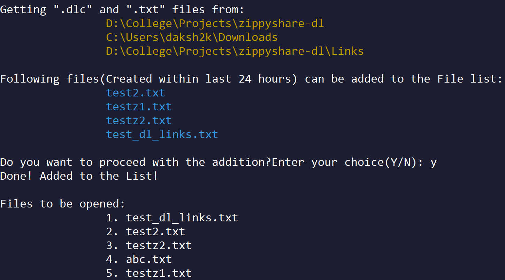
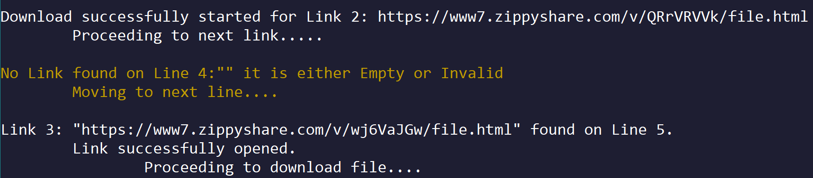
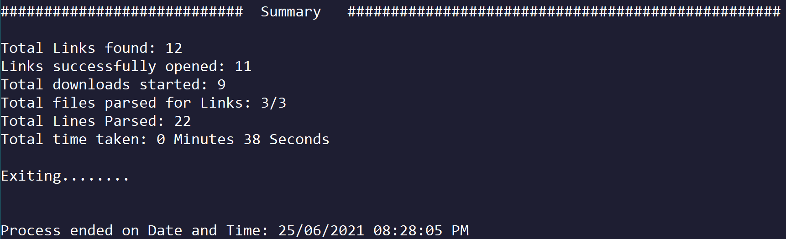
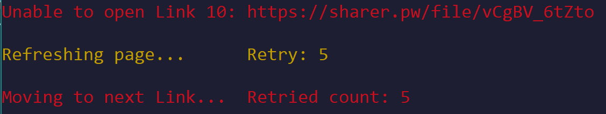

# Zippyshare downloader and Links Extractor
Python script to automatically download from Zippyshare using [Selenium package](https://www.selenium.dev/) and [Internet Download Manager](https://www.internetdownloadmanager.com/).\
Download [IDM](https://www.internetdownloadmanager.com/download.html) from here for downloading multiple files.
1. Run the [main.py](./main.py) script after checking the [Requirements](https://github.com/daksh2k/zippyshare-dl#requirementsinstallation) preferrably in a [virtual env.](https://docs.python.org/3/library/venv.html) 

    See **[features](https://github.com/daksh2k/zippyshare-dl#features)** for usage examples.
2. ### The Links will be saved in a text file which can then be imported to idm from: 
   Tasks>Import>from text file

3. Other option is set the `START_DOWNLOADING` variable to 1 in the config file which will start downloading instantly. **(Useful for less Links)** 
4. See [the config file here](./config.py) for more configurable options. 

## Requirements/Installation
- Platform - Windows only.
- Chrome Browser.
- Chromedriver(Included).
- IDM
   
   Not required for running the script.(Only For Downloading Links afterwards)
- Python >= v3.6
- Install requirements yourself by running the following commands from powershell:
  ``` bash
  git clone https://github.com/daksh2k/zippyshare-dl.git
  cd zippyshare-dl
  pip install virtualenv
  python -m venv env
  env/scripts/activate.ps1
  pip install -r requirements.txt
  ```

- Or simply Install via the [install.ps1](./install.ps1) script after cloning/downloading the repositary.

 
## Features
- Supported formats:
  - `.txt`
  - `.dlc`
  - Filecrypt Links
  - Pass any web link directly in arguments or input or through a file.
- Parse from a Single File or Multiple Files. 

  Example-:
   1. `python main.py test.txt` 
   2. `python main.py https://filecrypt.co/Container/31B1864087.html`
   3. `python main.py test.dlc https://filecrypt.co/Container/31B1864087.html test2.txt Links/test3.txt`
   4. `python main.py` *Pass empty for adding the files later or for Automatic picking of Files.*

- Directly parse from filecrypt links.(Only those links without recaptcha)
- Automatically get recently created(within last 24 hours)  `.dlc` and `.txt` files from certain folders.
   
- Duplicate check to see if file is already parsed.
- Automatically Update chromedriver if out of date.
- Support for Sharer.pw Links, for  directly clicking Download button.
- Skips Empty or Invalid Lines in the File.
     
- Summary after completion.
     
- Open Links in new tab in the browser if unsupported Link.
- Retry Links if unable to Load website.  
  